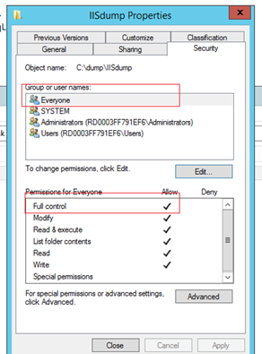

<<<<<<< HEAD
#如何在web role 中抓取IIS dump文件

Azure云服务中的role可以理解为一种部署方式，而我们要运行的程序，都是要运行在进程上的。Azure云服务中有两种role，分别是web role和worker role，这两种role的主要区别在于，web role上的项目是被部署在IIS服务上，而worker role上的项目被部署在独立的进程上。因此，我们一般都使用web role来部署一些对外公开访问的网站或者服务。

我们在使用web role部署对外公开的应用时，尤其是一些网站，在某些情况下会遇到网站服务不可用的情况，此时如果排除了Azure平台的问题，我们需要查看在问题期间IIS服务是不是存在什么问题。这篇文章就是主要介绍当您是使用web role full IIS服务时，我们发现web role不可用并且非Azure平台问题时，应该如何收集dump文件来分析IIS出现了什么问题。

##问题症状：
当您排除Azure平台问题后，发现您的服务还是有问题，这个时候，您可以RDP到您的web role中，查看路径
`C:\Resources\Directory\{DeploymentID}.{Rolename}.DiagnosticStore\LogFiles\Web`下的IIS日志，看看是否有任何的线索：  

如果您IIS日志在问题期间返回200，则证明IIS可以正常处理请求，如：  

	2016-6-31 22:14:00 W3SVC1273337584 RD77890D5837721 xx.xxx.xxx.x POST  
	/Api/Aggregator/MemberInfoQuery - 80 - xx.xxx.xxx.xxx HTTP/1.1 - - -   
	yourcloudservicename.chinacloudapp.cn 200 0 0 1574 453 140


如果您的IIS日志在问题期间返回503或者404，则说明您的IIS server无法正常成功处理请求，比如503.2，它表示您当前时间的并发请求超过了限定数，也就是您的web应用因为某些原因对外面的请求处理不过来，至于为什么我们就必须通过生成dump文件来分析。  

	2016-6-31 01:52:25 W3SVC1273337584 RD77890D5837721 xx.xxx.xxx.x POST  
	/Api/Aggregator/LogisticCodeQuery - 80 - xx.xxx.xxx.xxx HTTP/1.0 - - -  
	yourcloudservicename.chinacloudapp.cn 503 2 0 214 354 106

##RDP到role上抓取dump文件：

如果当您查看IIS日志，发现IIS返回是不正常的情况(404/503…)并且该问题还持续发生，您可以通过RDP到对应的role上抓取dump来分析IIS进程(w3wp.exe)是否存在hang住或者其他逻辑问题，具体方法如下：


1. 请配置好您web role RDP, 并登录到相应的role上。
2. 打开您的task manager->details->找到w3wp.exe并选中。
3. 右键选择create dump file，在发生问题期间每隔3分钟抓取一次dump文件并保存，抓取3-5次，生成dump文件后进行分析。

##通过IIS做配置生成自定义dump文件

我们简单介绍当问题持续发生时如何抓取dump的方法，但是我们经常遇到一些问题只是间断性发生，或者发生时间短暂手动抓取dump可能来不及，这种情况下，我们可以通过IIS提前做好配置，使得IIS在某些特定的触发条件下通过procdump为我们自动抓取dump，具体方法如下：

1. 从[链接](http://download.sysinternals.com/files/ProcessMonitor.zip)下载procdump.exe和procdump64.exe，放在某个目录下（生成dump的位置跟该目录是一致的），这里我们以C:\dump\IISdump为例。
2. 打开web.config, 可以将以下高亮部分&lt;traceFailedRequests&gt;粘贴到您的web.config里的&lt;system.webServer&gt;内。
&lt;traceFailedRequests&gt;是用来定义一个web请求到IIS server如果超时、失败（404/500）时记录相应的状态，详细的使用方法您可以参考[链接](https://www.iis.net/configreference/system.webserver/tracing/tracefailedrequests/add/failuredefinitions)。下面我们以一个请求响应超过40s则生成dump为例。

	    <configuration>
	    <system.webServer>
	                
	    <tracing>
	      <traceFailedRequests>
	        <remove path="*" />
	        <add path="*" customActionExe="C:\dump\IISdump\procdump.exe" customActionParams="-ma -accepteula %1% C:\dump\IISdump" customActionTriggerLimit="10">
	          <traceAreas>
	            <add provider="ASP" verbosity="Verbose" />
	            <add provider="ASPNET" areas="Infrastructure,Module,Page,AppServices" verbosity="Verbose" />
	            <add provider="ISAPI Extension" verbosity="Verbose" />
	            <add provider="WWW Server" areas="Authentication,Security,Filter,StaticFile,CGI,Compression,Cache,RequestNotifications,Module,FastCGI" verbosity="Verbose" />
	          </traceAreas>
	          <failureDefinitions timeTaken="00:00:40" />
	        </add>
	      </traceFailedRequests>
	    </tracing>
	                
	    
	    </system.webServer>
	    </configuration>

     
	> **注意：**绿色高亮部分可以设置生成dump的触发条件，我们这边是以IIS处理请求超过40s则生成dump为例，您可以根据自己的需求做一些改动。
红色高亮部分为生成dump的存放位置，您也可以根据自己的需求做修改。 

3. 修改目录D:\Windows\System32\inetsrv\config下的applicationHost.config文件  
  在system.applicationHost部分做如下修改，添加customActionsEnabled="true"

	     <traceFailedRequestsLogging enabled="true"  maxLogFiles="1000" customActionsEnabled="true" />
	>**注意:**  绿色高亮部分是需要添加的部分，因为我们是做customize的dump生成，如果不加，则dump无法自动生成。

4. 如果您是像我的示例那样，将dump生成在C盘的某个位置，会因为要在c盘上写数据被denial掉，所以我们需要把该文件添加everyone权限，并且设置成full control，但是如果您选择dump文件是生成在E盘或者其他非系统盘的位置，则可以不用做这一步。  
 

5. 验证该问题，可以生成dump文件：  
 
	
=======
#如何在 web role 中抓取 IIS dump 文件

Azure 云服务中的 role 可以理解为一种部署方式，而我们要运行的程序，都是要运行在进程上的。 Azure 云服务中有两种 role，分别是 web role 和 worker role，这两种 role 的主要区别在于，web role 上的项目是被部署在 IIS 服务上，而 worker role 上的项目被部署在独立的进程上。因此，我们一般都使用 web role 来部署一些对外公开访问的网站或者服务。

我们在使用 web role 部署对外公开的应用时，尤其是一些网站，在某些情况下会遇到网站服务不可用的情况，此时如果排除了 Azure 平台的问题，我们需要查看在问题期间 IIS 服务是不是存在什么问题。这篇文章就是主要介绍当您是使用 web role full IIS 服务时，我们发现 web role 不可用并且非 Azure 平台问题时，应该如何收集 dump 文件来分析 IIS 出现了什么问题。

###问题症状：
当您排除 Azure 平台问题后，发现您的服务还是有问题，这个时候，您可以 RDP 到您的 web role 中，查看路径 
C:\Resources\Directory\{DeploymentID}.{Rolename}.DiagnosticStore\LogFiles\Web 下的 IIS 日志，看看是否有任何的线索：  

如果您 IIS 日志在问题期间返回 200，则证明 IIS 可以正常处理请求，如：  

	2016-6-31 22:14:00 W3SVC1273337584 RD77890D5837721 xx.xxx.xxx.x POST  
	/Api/Aggregator/MemberInfoQuery - 80 - xx.xxx.xxx.xxx HTTP/1.1 - - -   
	yourcloudservicename.chinacloudapp.cn 200 0 0 1574 453 140


如果您的 IIS 日志在问题期间返回 503 或者 404，则说明您的 IIS server 无法正常成功处理请求，比如 503.2，它表示您当前时间的并发请求超过了限定数，也就是您的 web 应用因为某些原因对外面的请求处理不过来，至于为什么我们就必须通过生成 dump 文件来分析。  

	2016-6-31 01:52:25 W3SVC1273337584 RD77890D5837721 xx.xxx.xxx.x POST  
	/Api/Aggregator/LogisticCodeQuery - 80 - xx.xxx.xxx.xxx HTTP/1.0 - - -  
	yourcloudservicename.chinacloudapp.cn 503 2 0 214 354 106

**RDP 到 role 上抓取 dump 文件：**

如果当您查看 IIS 日志，发现 IIS 返回是不正常的情况(404/503…)并且该问题还持续发生，您可以通过 RDP 到对应的 role 上抓取 dump 来分析 IIS 进程( w3wp.exe )是否存在 hang 住或者其他逻辑问题，具体方法如下：


1. 请配置好您 web role RDP, 并登录到相应的 role 上。
2. 打开您的 task manager -> details ->找到 w3wp.exe 并选中。
3. 右键选择 create dump file，在发生问题期间每隔 3 分钟抓取一次 dump 文件并保存，抓取 3-5 次，生成 dump 文件后进行分析。

**通过 IIS 做配置生成自定义 dump 文件：**

我们简单介绍当问题持续发生时如何抓取 dump 的方法，但是我们经常遇到一些问题只是间断性发生，或者发生时间短暂手动抓取 dump 可能来不及，这种情况下，我们可以通过 IIS 提前做好配置，使得 IIS 在某些特定的触发条件下通过 procdump 为我们自动抓取 dump，具体方法如下：

1. 从[链接](http://download.sysinternals.com/files/ProcessMonitor.zip)下载 procdump.exe 和 procdump64.exe，放在某个目录下（生成 dump 的位置跟该目录是一致的），这里我们以 C:\dump\IISdump 为例。
2. 打开 web.config, 可以将以下高亮部分 &lt;traceFailedRequests&gt; 粘贴到您的 web.config 里的 &lt;system.webServer&gt; 内。
&lt;traceFailedRequests&gt; 是用来定义一个 web 请求到 IIS server 如果超时、失败（404/500）时记录相应的状态，详细的使用方法您可以参考[链接](https://www.iis.net/configreference/system.webserver/tracing/tracefailedrequests/add/failuredefinitions)。下面我们以一个请求响应超过 40s 则生成 dump 为例。

	    <configuration>
	    <system.webServer>
	                
	    <tracing>
	      <traceFailedRequests>
	        <remove path="*" />
	        <add path="*" customActionExe="C:\dump\IISdump\procdump.exe" customActionParams="-ma -accepteula %1% C:\dump\IISdump" customActionTriggerLimit="10">
	          <traceAreas>
	            <add provider="ASP" verbosity="Verbose" />
	            <add provider="ASPNET" areas="Infrastructure,Module,Page,AppServices" verbosity="Verbose" />
	            <add provider="ISAPI Extension" verbosity="Verbose" />
	            <add provider="WWW Server" areas="Authentication,Security,Filter,StaticFile,CGI,Compression,Cache,RequestNotifications,Module,FastCGI" verbosity="Verbose" />
	          </traceAreas>
	          <failureDefinitions timeTaken="00:00:40" />
	        </add>
	      </traceFailedRequests>
	    </tracing>
	                
	    
	    </system.webServer>
	    </configuration>

    **注意：**   
 绿色高亮部分可以设置生成 dump 的触发条件，我们这边是以 IIS 处理请求超过 40s 则生成 dump 为例，您可以根据自己的需求做一些改动。
红色高亮部分为生成 dump 的存放位置，您也可以根据自己的需求做修改。 
3. 修改目录 D:\Windows\System32\inetsrv\config 下的 applicationHost.config 文件  
  在 system.applicationHost 部分做如下修改，添加 customActionsEnabled="true"

	     <traceFailedRequestsLogging enabled="true"  maxLogFiles="1000" customActionsEnabled="true" />
**注意:**  
 绿色高亮部分是需要添加的部分，因为我们是做 customize 的 dump 生成，如果不加，则 dump 无法自动生成。

4. 如果您是像我的示例那样，将 dump 生成在 C 盘的某个位置，会因为要在 C 盘上写数据被 denial 掉，所以我们需要把该文件添加 everyone 权限，并且设置成 full control，但是如果您选择 dump 文件是生成在E盘或者其他非系统盘的位置，则可以不用做这一步。  
 

5. 验证该问题，可以生成 dump 文件：  
 
	
>>>>>>> origin/master
